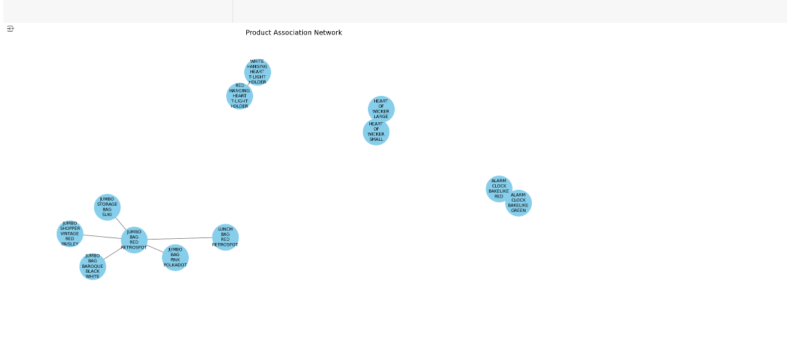
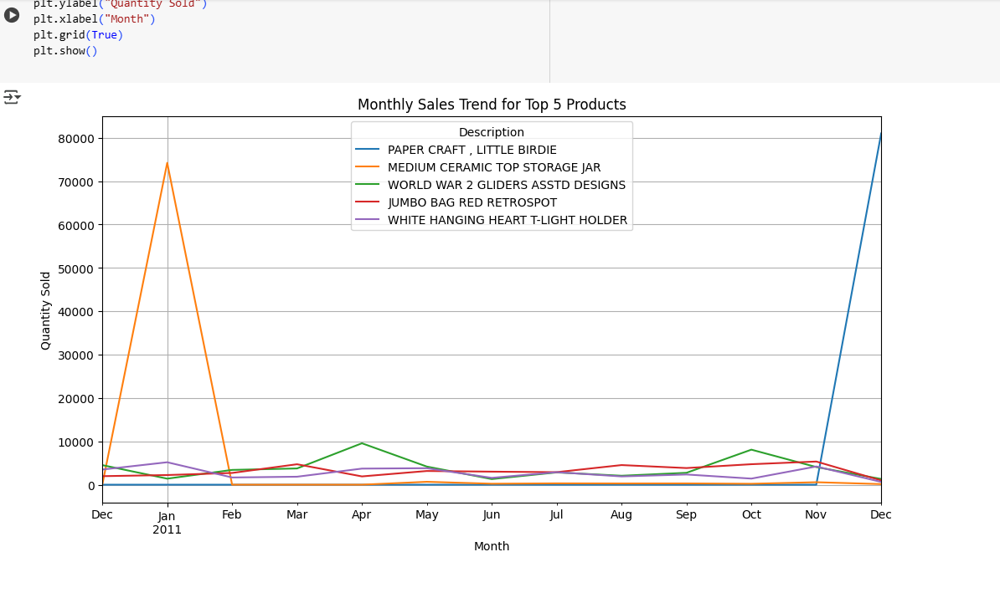

# Market Basket Analysis
This project uses the FP-Growth algorithm and association rules to perform Market Basket Analysis on UK retail data. It finds product combinations that frequently occur together and recommends related products.
## File
`market_basket_analysis.py`: Python script for data preprocessing, pattern mining, product association, and visualization.
## Features
- Load and clean transactional retail data
- Filter out canceled, missing, or invalid transactions
- Transform data into a basket format (invoice × items)
- Use FP-Growth algorithm to find frequent itemsets
- Generate association rules based on **lift**
- Visualize product associations using a **network graph**
- Recommend products based on purchased items
- Plot sales trend of top-selling products
## Visualizations
### Product Association Network

This graph shows connections between products that are often bought together.
### Monthly Sales Trends

This chart displays monthly trends for the top 5 products sold.
## Tools Used
- Python
- Pandas
- Matplotlib
- NetworkX
- mlxtend (for FP-Growth and Association Rules)

